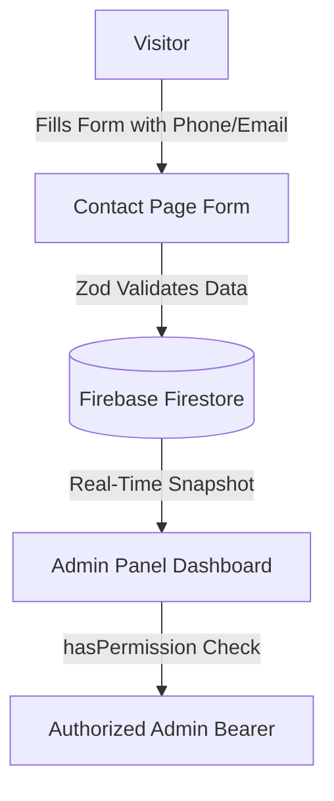

# Technical Walkthrough & Interview Presentation Summary

This document provides a comprehensive structured summary of the design architecture, implementations, and optimization steps added to the **Sherlock Holmes Club x KARE** portal. It is formatted to help you explain these changes and the technical rationale behind them during your interview.

---

## 1. Project Overview
The portal is a high-performance web application built for the **Sherlock Holmes Club** at **Kalasalingam Academy of Research and Education (KARE)**. It serves two main purposes:
1. **Public-facing interface**: Presents club details, circulars, team lists, upcoming events, and a contact gateway for campus students.
2. **Admin Portal Console**: An authenticated dashboard for club administrators to manage assets, view circulars, handle inquiries, and review system logs in real time.

---

## 2. Technical Stack
- **Framework**: Next.js (App Router, React 18)
- **Language**: TypeScript
- **Database & Services**: Firebase Firestore, Firebase Authentication, Firebase Storage
- **Forms & Validation**: React Hook Form, Zod Resolver
- **Styling**: Tailwind CSS
- **Icons**: Lucide React

---

## 3. Detailed Implementations (Feature-by-Feature)

### Feature A: SEO & Link-Sharing Preview Resolution
* **The Problem**: 
  - Sharing the club's website on platforms like WhatsApp or Telegram displayed the default black Vercel triangle instead of the club's banner.
  - The browser tab favicon was not appearing in Google Search results.
* **The Solution**:
  - **Asset Integration**: Generated a branded, dark-themed landscape banner image (`opengraph-image.png`) representing the Sherlock Holmes Club. Served it statically at `/public/opengraph-image.png` and under `/app` to align with Next.js dynamic metadata matching.
  - **Favicon Crawler Feed**: Re-routed standard favicons (`favicon.ico`, `icon.png`, `apple-icon.png`) as static root assets under the `/public` directory to guarantee discovery by Google's low-frequency favicon crawler.
  - **Metadata Configuration**: Configured `metadataBase` inside `app/layout.tsx` to point to the production URL. Populated the `openGraph` and `twitter` objects to output absolute URLs for preview crawlers.
  - **Developer Attribution**: Updated description strings across layout configurations to display `"Developed by ASD Creations"`.

---

### Feature B: Interactive Google Map Integration
* **The Problem**: The contact page previously contained a generic visual placeholder for the college location.
* **The Solution**: 
  - Resolved your short share link (`https://maps.app.goo.gl/N7pAeXitWTfiAwzG8`) into the official coordinate mapping for *Kalasalingam Academy of Research and Education*.
  - Embedded a responsive Google Maps `<iframe>` widget inside `app/contact/ContactClient.tsx` that replaces the static placeholder.
  - Applied design-aligned styles (smooth borders, rounded corners matching the UI cards, responsive aspect ratio, and lazy-loading for fast page loading).

---

### Feature C: Mobile Number Collection
* **The Problem**: The contact form collected Name, Email, Subject, and Message, but missed collecting the visitor's mobile number, which is crucial for quick campus communication.
* **The Solution**:
  - **Interface Update**: Added a new `"phone"` string field to the `ContactMessage` interface in `types/index.ts`.
  - **Form Validation**: Configured Zod schemas inside `components/common/ContactForm.tsx` to require a `phone` input containing 10 to 15 digits, using a regex format filter (`/^[0-9+\s-]+$/`).
  - **Visual Form Grid**: Placed the "Mobile Number" input field side-by-side with the "Subject" field to maintain form symmetry.

---

### Feature D: Admin "Enquiry Messages" Management System
* **The Problem**: Form messages were sent to Firestore but had no visual inbox in the admin portal, forcing administrators to check the Firestore database console manually.
* **The Solution**:
  - **Real-Time Data Streams**: Added a state hooks array and set up a Firebase Firestore `onSnapshot` listener targeted at the `contactMessages` collection. It automatically updates the inbox live as soon as a visitor clicks "Send Message" without requiring page reloads.
  - **Navigation & Role Permissions**:
    - Created an "Enquiry Messages" tab in the sidebar navigation with a message bubble icon (`MessageSquare`).
    - Added the `"enquiries"` tab identifier to the `ModuleName` type and modified `hasPermission()` to allow administrators, coordinators, presidents, vice-presidents, and secretaries to access the inbox, while restricting access for roles like media editors.
  - **Dashboard Interface**:
    - **Split-Screen UX**: Built a responsive dual-column list-and-detail view. Clicking any message in the inbox list populates a side card containing the full message details.
    - **Action Gateways**: Added a **"Reply via Email"** button (generating a pre-filled `mailto:` template) and a **"Delete Message"** option.
    - **Audit Trails**: Deletion actions are logged inside the `activityLogs` collection to maintain accountability.

---

## 4. Key Questions You May Face in the Interview

#### 1. Why was link sharing showing the Vercel logo instead of the club's name and image?
> **Answer**: Social platforms use crawlers to extract Open Graph (`og:`) metadata tags from the website's HTML header. Previously, these fields were not defined in our Next.js metadata config. As a result, crawlers fell back to caching the default template hosting assets (Vercel's inverted triangle logo). We resolved this by explicitly populating the `openGraph` and `twitter` metatag configurations in Next.js and linking them to a custom generated opengraph banner image resolved via `metadataBase`.

#### 2. Why does the favicon take time to show up in Google Search even after deploying the fix?
> **Answer**: Google crawls page favicons using a separate, low-frequency crawler called "Googlebot-Image/Favicon" that runs much less frequently than the main search index crawler. To prepare for this, we placed stable favicon assets at the static root `/public` folder and set up explicit static `<link>` elements to bypass Next.js's dynamic caching query parameters (like `?v=...`). We can speed this up by requesting index updates on the home page via Google Search Console.

#### 3. How does the live dashboard update without refreshing the page?
> **Answer**: It utilizes Firestore's real-time sync engine. We implemented an `onSnapshot()` listener targeted at the `contactMessages` collection. When a user submits the form, it performs an write operation in Firestore. The listener detects this change in real-time and pushes the updated data array directly to our React state, triggering a component re-render instantly.

#### 4. How did you validate the mobile number fields on the front-end?
> **Answer**: We used **React Hook Form** paired with a **Zod** schema resolver. The schema defines the validation rules: minimum 10 characters, maximum 15 characters, and a regular expression (`/^[0-9+\s-]+$/`) which only allows numbers, spaces, and standard plus/minus signs. This prevents invalid submissions from ever hitting the Firebase database.
